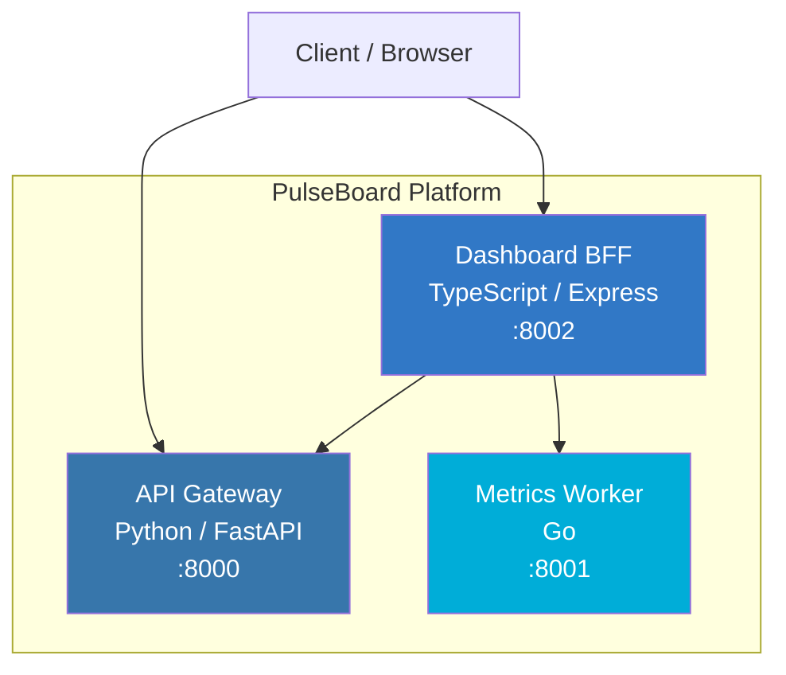

# PulseBoard

Real-time metrics dashboard platform built with a microservices architecture. Collect, aggregate, and visualize system metrics through three specialized services.

## Architecture



### Services

| Service | Language | Port | Role |
|---------|----------|------|------|
| **API Gateway** | Python (FastAPI) | 8000 | Metrics CRUD API — create, list, query, and delete metrics |
| **Metrics Worker** | Go | 8001 | Statistical aggregation engine — computes sum, avg, min, max, std_dev |
| **Dashboard BFF** | TypeScript (Express) | 8002 | Backend-for-Frontend — dashboard-oriented metric views and summaries |

## Quick Start

### Prerequisites

- Docker & Docker Compose
- (For local dev) Python 3.12+, Go 1.22+, Node.js 20+

### Run with Docker Compose

```bash
cp .env.example .env
make up
```

### Check Health

```bash
make health
```

### Stop

```bash
make down
```

## API Reference

### API Gateway (`:8000`)

| Method | Endpoint | Description |
|--------|----------|-------------|
| `GET` | `/health` | Health check |
| `POST` | `/api/v1/metrics` | Record a metric |
| `GET` | `/api/v1/metrics` | List all metrics (optional `?name=` filter) |
| `GET` | `/api/v1/metrics/{name}` | Get all entries for a metric |
| `GET` | `/api/v1/metrics/{name}/latest` | Get latest value for a metric |
| `DELETE` | `/api/v1/metrics/{name}` | Delete all entries for a metric |

The in-memory store is bounded per metric name via `MAX_METRICS_PER_NAME`
(default `1000`). When the limit is exceeded, the oldest entries are evicted
in FIFO order. Set the variable to `0` to disable the cap.

**Create a metric:**

```bash
curl -X POST http://localhost:8000/api/v1/metrics \
  -H "Content-Type: application/json" \
  -d '{"name": "cpu_usage", "value": 72.5, "tags": {"host": "srv-1"}}'
```

### Metrics Worker (`:8001`)

| Method | Endpoint | Description |
|--------|----------|-------------|
| `GET` | `/health` | Health check |
| `POST` | `/api/v1/aggregate` | Compute statistics for a set of values |

**Aggregate values:**

```bash
curl -X POST http://localhost:8001/api/v1/aggregate \
  -H "Content-Type: application/json" \
  -d '{"values": [10, 20, 30, 40, 50]}'
```

The response includes `count`, `sum`, `avg`, `min`, `max`, `std_dev`,
`median`, `p95`, and `p99` (percentiles are computed via linear interpolation).

### Dashboard BFF (`:8002`)

| Method | Endpoint | Description |
|--------|----------|-------------|
| `GET` | `/health` | Health check |
| `POST` | `/api/v1/dashboard/metrics` | Add a dashboard metric |
| `GET` | `/api/v1/dashboard/summary` | Get dashboard summary (last 50 metrics) |
| `GET` | `/api/v1/dashboard/metrics/{name}` | Get metrics by name |

## Development

### Run Tests

```bash
make test
```

Or individually:

```bash
make test-python
make test-go
make test-ts
```

### Project Structure

```
pulseboard-app/
├── docker-compose.yml
├── Makefile
├── .env.example
├── .gitignore
├── .github/workflows/ci.yml
├── services/
│   ├── api-gateway/          # Python FastAPI
│   │   ├── app.py
│   │   ├── requirements.txt
│   │   ├── Dockerfile
│   │   └── tests/
│   ├── metrics-worker/       # Go
│   │   ├── main.go
│   │   ├── main_test.go
│   │   ├── go.mod
│   │   └── Dockerfile
│   └── dashboard-bff/        # TypeScript Express
│       ├── src/index.ts
│       ├── tests/app.test.ts
│       ├── package.json
│       ├── tsconfig.json
│       └── Dockerfile
└── README.md
```

## Environment Variables

See [`.env.example`](.env.example) for all available configuration options.

## CI/CD

GitHub Actions runs on every push and PR to `main`:
1. Python tests (pytest)
2. Go tests (go test)
3. TypeScript tests (jest)
4. Docker Compose build verification

> **Note:** The `.github/workflows/ci.yml` file may need to be manually added after initial setup due to GitHub API restrictions.

<details>
<summary>CI Workflow Content</summary>

```yaml
name: CI

on:
  push:
    branches: [main]
  pull_request:
    branches: [main]

jobs:
  test-python:
    runs-on: ubuntu-latest
    defaults:
      run:
        working-directory: services/api-gateway
    steps:
      - uses: actions/checkout@v4
      - uses: actions/setup-python@v5
        with:
          python-version: "3.12"
      - run: pip install -r requirements.txt
      - run: pytest -v

  test-go:
    runs-on: ubuntu-latest
    defaults:
      run:
        working-directory: services/metrics-worker
    steps:
      - uses: actions/checkout@v4
      - uses: actions/setup-go@v5
        with:
          go-version: "1.22"
      - run: go test -v ./...

  test-typescript:
    runs-on: ubuntu-latest
    defaults:
      run:
        working-directory: services/dashboard-bff
    steps:
      - uses: actions/checkout@v4
      - uses: actions/setup-node@v4
        with:
          node-version: "20"
      - run: npm install
      - run: npm test

  docker-build:
    runs-on: ubuntu-latest
    needs: [test-python, test-go, test-typescript]
    steps:
      - uses: actions/checkout@v4
      - run: docker compose build
```

</details>
