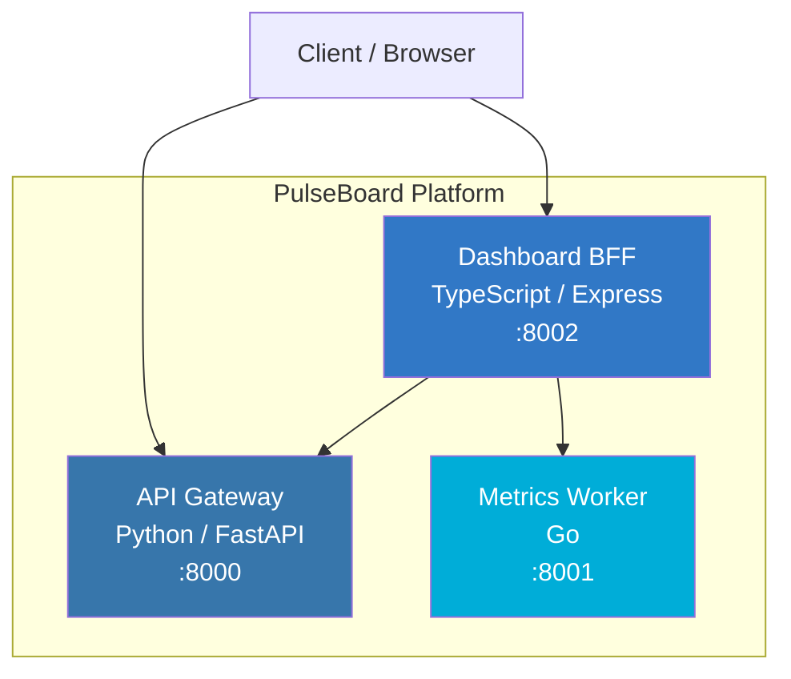

# PulseBoard

Real-time metrics dashboard platform built with a microservices architecture. Collect, aggregate, and visualize system metrics through three specialized services.

## Architecture



### Services

| Service | Language | Port | Role |
|---------|----------|------|------|
| **API Gateway** | Python (FastAPI) | 8000 | Metrics CRUD API — create, list, query, and delete metrics |
| **Metrics Worker** | Go | 8001 | Statistical aggregation engine — computes sum, avg, min, max, std_dev |
| **Dashboard BFF** | TypeScript (Express) | 8002 | Backend-for-Frontend — dashboard-oriented metric views and summaries |

## Quick Start

### Prerequisites

- Docker & Docker Compose
- (For local dev) Python 3.12+, Go 1.22+, Node.js 20+

### Run with Docker Compose

```bash
cp .env.example .env
make up
```

### Check Health

```bash
make health
```

### Stop

```bash
make down
```

## API Reference

### API Gateway (`:8000`)

| Method | Endpoint | Description |
|--------|----------|-------------|
| `GET` | `/health` | Health check |
| `POST` | `/api/v1/metrics` | Record a metric |
| `GET` | `/api/v1/metrics` | List metrics（`?name=` / `?since=` / `?until=` ISO 8601 / `?limit=` / `?offset=`、レスポンスに `total` / `limit` / `offset`） |
| `GET` | `/api/v1/metrics/{name}` | Get all entries for a metric |
| `GET` | `/api/v1/metrics/{name}/latest` | Get latest value for a metric |
| `GET` | `/api/v1/metrics/{name}/stats` | Aggregate stats for a metric (count/min/max/sum/avg/latest) |
| `DELETE` | `/api/v1/metrics/{name}` | Delete all entries for a metric |

The in-memory store is bounded per metric name via `MAX_METRICS_PER_NAME`
(default `1000`). When the limit is exceeded, the oldest entries are evicted
in FIFO order. Set the variable to `0` to disable the cap.

**並行安全性 (Concurrency safety):**

FastAPI は `def` ハンドラをスレッドプール上で並行に実行するため、in-memory
store (`metrics_store`) と ID 採番カウンタ (`metrics_seq`) へのアクセスは
`threading.RLock` で同期化されている。これにより以下が保証される:

- 同一 `name` に対する並行 POST でも ID は一意（`<name>-<seq>` が衝突しない）
- FIFO eviction 後も `MAX_METRICS_PER_NAME` の上限が厳密に守られる
- DELETE と POST の競合時にも store と seq の整合性が保たれる

**Create a metric:**

```bash
curl -X POST http://localhost:8000/api/v1/metrics \
  -H "Content-Type: application/json" \
  -d '{"name": "cpu_usage", "value": 72.5, "tags": {"host": "srv-1"}}'
```

**入力バリデーション:**

- `name` は 1〜128 文字の文字列
- `value` は有限な数値のみ受け付け、`+Infinity` / `-Infinity` / `NaN` は `422` で拒否される
  （JSON 仕様上 `1e500` は許容されるが Python では `inf` に解釈されるため、集計や直近値の破壊を防ぐ目的）

**Get aggregate stats for a metric:**

保持中の値を 1 リクエストで集計する。値は記録時に有限値であることが保証されているため、
`min` / `max` / `sum` / `avg` は安全に算出できる。該当名が無ければ `404`。

```bash
curl http://localhost:8000/api/v1/metrics/cpu_usage/stats
```

```json
{
  "name": "cpu_usage",
  "count": 4,
  "min": 10.0,
  "max": 40.0,
  "sum": 100.0,
  "avg": 25.0,
  "latest": 40.0,
  "latest_recorded_at": "2026-05-24T00:00:03+00:00",
  "first_recorded_at": "2026-05-24T00:00:00+00:00"
}
```

### Metrics Worker (`:8001`)

| Method | Endpoint | Description |
|--------|----------|-------------|
| `GET` | `/health` | Health check |
| `POST` | `/api/v1/aggregate` | Compute statistics for a set of values |

**Aggregate values:**

```bash
curl -X POST http://localhost:8001/api/v1/aggregate \
  -H "Content-Type: application/json" \
  -d '{"values": [10, 20, 30, 40, 50]}'
```

The response includes `count`, `sum`, `avg`, `min`, `max`, `std_dev`,
`median`, `p95`, and `p99` (percentiles are computed via linear interpolation).

**Hardening / DoS 対策:**

- リクエストボディ全体は `MAX_AGGREGATE_BODY_BYTES`（既定 `1048576` = 1 MiB）を超えると
  `413 Request Entity Too Large` で拒否される。
- `values` 配列の要素数は `MAX_AGGREGATE_VALUES`（既定 `10000`）を超えると `413` で拒否される。
- HTTP サーバには `WORKER_READ_HEADER_TIMEOUT`（既定 `5` 秒）、`WORKER_READ_TIMEOUT`（既定 `15` 秒）、
  `WORKER_WRITE_TIMEOUT`（既定 `15` 秒）、`WORKER_IDLE_TIMEOUT`（既定 `60` 秒）が設定される
  （Slowloris 等の遅延接続攻撃対策）。
- いずれの上限も値を `0` 以下に設定すると無効化できる（テスト用途）。

### Dashboard BFF (`:8002`)

| Method | Endpoint | Description |
|--------|----------|-------------|
| `GET` | `/health` | Health check |
| `POST` | `/api/v1/dashboard/metrics` | Add a dashboard metric |
| `GET` | `/api/v1/dashboard/summary` | Get dashboard summary（既定で最新 50 件、`?limit=` で件数指定可） |
| `GET` | `/api/v1/dashboard/metrics/names` | 保持中の distinct な metric 名一覧を `{name, count, latest_recorded_at}` 形式で昇順に返す。`?since=` / `?until=` (ISO8601) で `recorded_at` の範囲内に観測のある名前のみに絞り込み可能（フィルタドロップダウンの populate 用途） |
| `GET` | `/api/v1/dashboard/metrics/count` | 保持中件数のみを返す軽量エンドポイント。`?name=` / `?since=` / `?until=` (ISO8601) で絞り込み。レスポンスは `{ total, by_name, name, since, until }` でレコード本体を含まない |
| `GET` | `/api/v1/dashboard/metrics/{name}` | Get metrics by name |
| `GET` | `/api/v1/dashboard/metrics/{name}/latest` | 指定 name の最新 1 件だけを返す軽量エンドポイント（リアルタイム表示・状態バッジ用、データ無しは `404`） |
| `GET` | `/api/v1/dashboard/metrics/{name}/stats` | 指定 name の集計統計（count/min/max/sum/avg/p50/p95/p99/latest）|
| `DELETE` | `/api/v1/dashboard/metrics` | 全メトリクスを破棄（運用時のクリーンアップ用） |
| `DELETE` | `/api/v1/dashboard/metrics/{name}` | 名前指定で破棄。`?since=` / `?until=` (ISO 8601) で `recorded_at` の範囲を絞り込んだ部分削除も可能（該当なしは `404`） |

ストアと入力サイズには次の上限がある（メモリ枯渇による DoS リスクを抑える目的）：

- `MAX_DASHBOARD_METRICS`（既定 `10000`、`0` 以下で無制限）— 保持件数を超えたら FIFO で古い順に破棄
- `MAX_REQUEST_BODY`（既定 `100kb`）— `express.json` のサイズ上限。超過リクエストは `413` で拒否

POST `/api/v1/dashboard/metrics` の入力バリデーション：

- `name` は文字列で、長さは 1〜128 文字（上流の api-gateway と同じ上限）
- `value` は `Number.isFinite` を満たす数値。`Infinity` / `-Infinity` / `NaN` は `400` で拒否
  （`JSON.parse('1e500')` は `Infinity` を返すため、`typeof === 'number'` だけでは抜けてしまう）

GET `/api/v1/dashboard/summary` の件数制御：

- `?limit=` で返却件数を指定可能（範囲 `1`〜`MAX_SUMMARY_LIMIT`、既定 `50`、後方互換）
- `MAX_SUMMARY_LIMIT`（既定 `500`、環境変数で上書き可）を超えると `400`
- 整数以外（`10.5` / `abc` / 配列）や `0` 以下も `400` で拒否
- レスポンスに `limit` フィールドが含まれ、要求された件数が明示される

```bash
# 既定（最新 50 件）
curl http://localhost:8002/api/v1/dashboard/summary

# 直近 10 件
curl "http://localhost:8002/api/v1/dashboard/summary?limit=10"
```

GET `/api/v1/dashboard/metrics/names` のレスポンスは `{ names: [{name, count, latest_recorded_at}], count, since, until }`。`since` / `until` は ISO8601 文字列で、`recorded_at` がその範囲内にある観測のみを集計対象にする：

```bash
# 全 distinct name（フィルタなし。since=null / until=null）
curl http://localhost:8002/api/v1/dashboard/metrics/names

# 直近 1 時間に観測のあった name のみ（GNU date 例）
curl "http://localhost:8002/api/v1/dashboard/metrics/names?since=$(date -u -d '1 hour ago' +%Y-%m-%dT%H:%M:%SZ)"

# 期間指定（since と until を両方指定）
curl "http://localhost:8002/api/v1/dashboard/metrics/names?since=2026-06-01T00:00:00Z&until=2026-06-11T00:00:00Z"
```

`since` / `until` の片方または両方を指定すると、`recorded_at` がパースできないレコードは集計対象外（窓内外を判定できないため）になる。フィルタを一切指定しない場合は従来通り全レコードを集計する。`since` が `until` より大きい場合は `400`、ISO8601 として解釈できない値も `400`。

## Development

### Run Tests

```bash
make test
```

Or individually:

```bash
make test-python
make test-go
make test-ts
```

### Project Structure

```
pulseboard-app/
├── docker-compose.yml
├── Makefile
├── .env.example
├── .gitignore
├── .github/workflows/ci.yml
├── services/
│   ├── api-gateway/          # Python FastAPI
│   │   ├── app.py
│   │   ├── requirements.txt
│   │   ├── Dockerfile
│   │   └── tests/
│   ├── metrics-worker/       # Go
│   │   ├── main.go
│   │   ├── main_test.go
│   │   ├── go.mod
│   │   └── Dockerfile
│   └── dashboard-bff/        # TypeScript Express
│       ├── src/index.ts
│       ├── tests/app.test.ts
│       ├── package.json
│       ├── tsconfig.json
│       └── Dockerfile
└── README.md
```

## Environment Variables

See [`.env.example`](.env.example) for all available configuration options.

## CI/CD

GitHub Actions ([`.github/workflows/ci.yml`](.github/workflows/ci.yml)) runs on every push and PR to `main`:
1. Python tests (flake8 lint + pytest)
2. Go tests (go vet + go test)
3. TypeScript tests (jest)
4. Docker Compose build verification (all tests がパスした後に実行)

<details>
<summary>CI Workflow Content</summary>

```yaml
name: CI

on:
  push:
    branches: [main]
  pull_request:
    branches: [main]

jobs:
  test-python:
    runs-on: ubuntu-latest
    defaults:
      run:
        working-directory: services/api-gateway
    steps:
      - uses: actions/checkout@v4
      - uses: actions/setup-python@v5
        with:
          python-version: "3.12"
      - run: pip install -r requirements.txt flake8
      - run: flake8 --max-line-length=120 --exclude=__pycache__ .
      - run: pytest -v

  test-go:
    runs-on: ubuntu-latest
    defaults:
      run:
        working-directory: services/metrics-worker
    steps:
      - uses: actions/checkout@v4
      - uses: actions/setup-go@v5
        with:
          go-version: "1.22"
      - run: go vet ./...
      - run: go test -v ./...

  test-typescript:
    runs-on: ubuntu-latest
    defaults:
      run:
        working-directory: services/dashboard-bff
    steps:
      - uses: actions/checkout@v4
      - uses: actions/setup-node@v4
        with:
          node-version: "20"
      - run: npm ci
      - run: npm test

  docker-build:
    runs-on: ubuntu-latest
    needs: [test-python, test-go, test-typescript]
    steps:
      - uses: actions/checkout@v4
      - run: docker compose build
```

</details>
