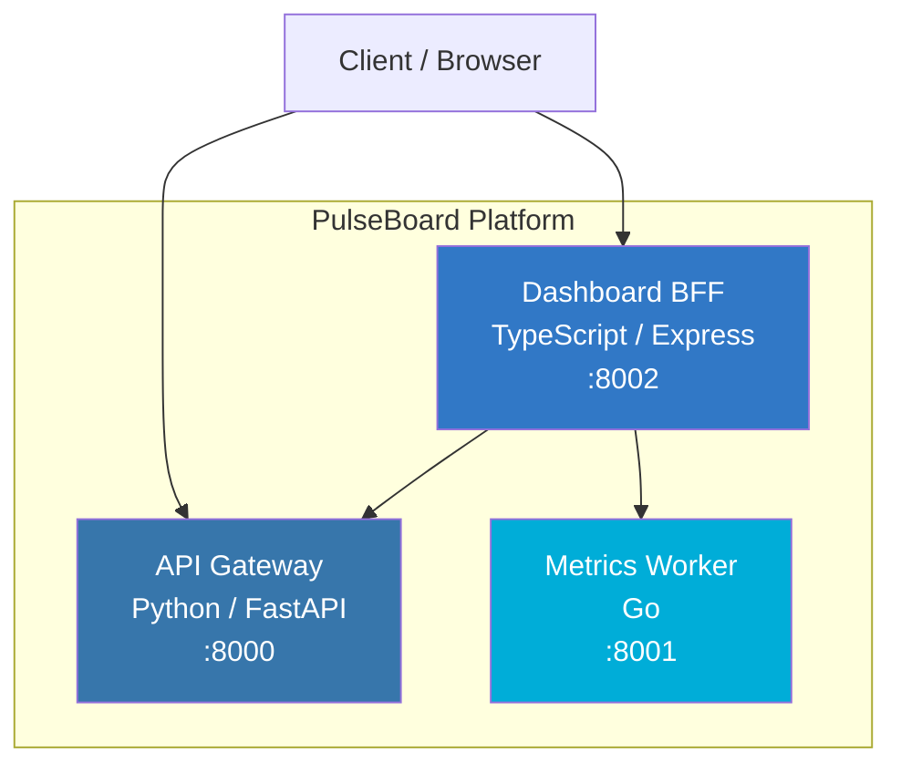
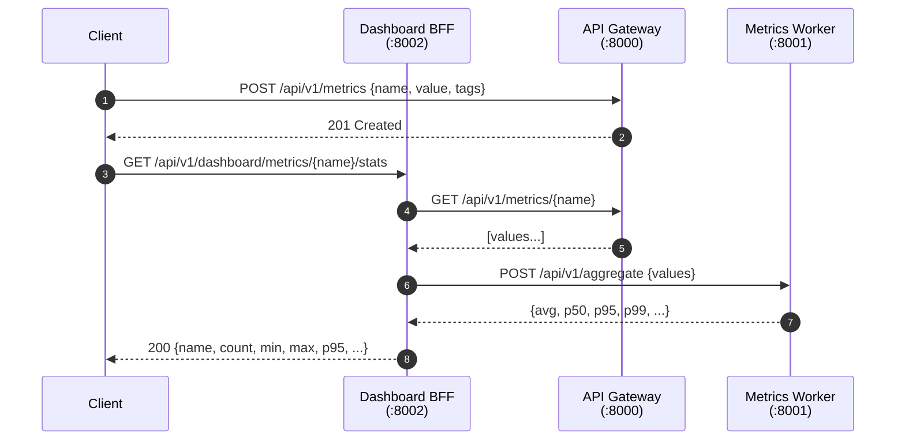

# PulseBoard アーキテクチャ

本ドキュメントは PulseBoard の内部設計をまとめたリファレンスである。README.md はクイックスタートと API 表を提供するのに対し、本ドキュメントは「なぜこの構成なのか」「サービス間はどう連携するか」「どこに拡張余地があるか」を説明する。

## 目次

1. [システム概要](#システム概要)
2. [サービス構成](#サービス構成)
3. [リクエストフロー](#リクエストフロー)
4. [コンポーネント責務](#コンポーネント責務)
5. [データモデルと状態管理](#データモデルと状態管理)
6. [並行性と DoS 対策](#並行性と-dos-対策)
7. [ヘルスチェックと起動順序](#ヘルスチェックと起動順序)
8. [スケーラビリティの制約](#スケーラビリティの制約)
9. [拡張ポイント](#拡張ポイント)
10. [関連ドキュメント](#関連ドキュメント)

---

## システム概要

PulseBoard はメトリクスを収集・集計・可視化するためのマイクロサービス基盤である。単一プロセスの Web アプリではなく、**3 つの独立サービス**として分割することで、それぞれ言語エコシステムの強みを活用している：

- **数値計算**は Go の並行モデルと標準ライブラリで安定・高速に処理する（Metrics Worker）
- **HTTP API 層**は Python (FastAPI) の型注釈と Pydantic による入力バリデーションを活用する（API Gateway）
- **フロントエンド寄りの集約・整形**は Node.js の非同期 I/O と JSON 親和性を活用する（Dashboard BFF）

各サービスは in-memory ストアで動作するため外部依存が無く、Docker Compose ひとつで開発・CI・デモを完結できる。

## サービス構成



| サービス | 言語 / FW | Port | 主責務 | 状態 |
|---------|-----------|------|--------|------|
| API Gateway | Python 3.12 / FastAPI | 8000 | メトリクス CRUD、時系列ビニング、名前一覧 | in-memory (`dict[name] -> deque`) |
| Metrics Worker | Go 1.22 / `net/http` | 8001 | 統計集計（平均/分散/歪度/尖度/分位点 等） | stateless（受け取った配列のみで計算） |
| Dashboard BFF | Node.js 20 / Express | 8002 | ダッシュボード向け集約・整形、上流呼び出し | in-memory (`Array` + FIFO) |

## リクエストフロー

代表的な「メトリクスを登録し、ダッシュボード用に集計値を得る」フロー：



ポイント：

- **書き込みは API Gateway に直行**する（BFF を経由しない）。Client からのメトリクス投入は書き込み経路の余計な hop を避けるためである。
- **読み出しは BFF が上流を fan-out** して整形する。BFF は「ダッシュボード UI が欲しい形」に合わせて Worker の集計結果と Gateway の生データを組み合わせる責務を持つ。
- Worker は **stateless** であり、任意の値配列を受け取って統計値だけを返す純関数的なサービスである（水平スケールが最も安全）。

## コンポーネント責務

### API Gateway (`services/api-gateway`)

- メトリクスの CRUD（POST / GET / DELETE）
- 時系列ビニング系エンドポイント（`by_day` / `by_hour_of_day` / `by_week`）
- distinct 名前一覧 / 件数集計
- 入力バリデーション：`name` は 1〜128 文字、`value` は有限数（`Infinity` / `NaN` を拒否）
- FIFO eviction による保持件数上限（`MAX_METRICS_PER_NAME`、既定 1000）

### Metrics Worker (`services/metrics-worker`)

- 単一エンドポイント `POST /api/v1/aggregate`
- 統計値: `count / sum / avg / min / max / range / variance / std_dev / cv / skewness / kurtosis / median / p25 / p75 / iqr / p90 / p95 / p99 / mad / outlier_count`
- パーセンタイルは線形補間で計算
- Slowloris 対策として `ReadHeaderTimeout` / `ReadTimeout` / `WriteTimeout` / `IdleTimeout` を明示設定
- リクエストボディ・要素数の上限（`MAX_AGGREGATE_BODY_BYTES` / `MAX_AGGREGATE_VALUES`）

### Dashboard BFF (`services/dashboard-bff`)

- ダッシュボード向けの集約・整形 API
- 上流サービス（API Gateway / Worker）を fan-out で呼び出す
- `express.json` のサイズ制限（`MAX_REQUEST_BODY`、既定 `100kb`）
- `GET /api/v1/dashboard/summary` は `?limit=` で件数指定可（`MAX_SUMMARY_LIMIT` で上限管理）

## データモデルと状態管理

すべてのサービスは **in-memory ストア**で動作する。永続化層は意図的に持たない。

| サービス | ストア | Eviction |
|---------|--------|----------|
| API Gateway | `dict[str, deque[Metric]]` + `dict[str, int]` (ID 採番) | `MAX_METRICS_PER_NAME` を超えたら FIFO |
| Metrics Worker | なし（stateless） | — |
| Dashboard BFF | `Array<Metric>` | `MAX_DASHBOARD_METRICS` を超えたら FIFO |

この設計は「デモ・CI・単一ノードのローカル開発」を主眼としている。本番運用では [拡張ポイント](#拡張ポイント) を参照。

## 並行性と DoS 対策

### API Gateway

FastAPI は `def` ハンドラをスレッドプールで並行実行するため、in-memory store と ID 採番カウンタへのアクセスは `threading.RLock` で同期化されている。これにより：

- 同一 `name` に対する並行 POST でも ID は一意（`<name>-<seq>` が衝突しない）
- FIFO eviction 後も上限件数が厳密に守られる
- DELETE と POST の競合時にも store / seq の整合性が保たれる

### Metrics Worker

- Slowloris 対策の HTTP タイムアウトを全て明示設定（`WORKER_READ_HEADER_TIMEOUT` / `WORKER_READ_TIMEOUT` / `WORKER_WRITE_TIMEOUT` / `WORKER_IDLE_TIMEOUT`）
- リクエストボディ全体を `MAX_AGGREGATE_BODY_BYTES`（既定 1 MiB）で制限
- `values` 配列を `MAX_AGGREGATE_VALUES`（既定 10000）で制限

### Dashboard BFF

- `express.json` のボディサイズを `MAX_REQUEST_BODY`（既定 `100kb`）で制限
- FIFO で `MAX_DASHBOARD_METRICS` を超えたレコードを破棄
- `?limit=` は整数バリデーション（浮動小数点や負数は 400）

## ヘルスチェックと起動順序

`docker-compose.yml` は各サービスに `healthcheck` を定義し、`dashboard-bff` は上流 2 サービスの `service_healthy` を `depends_on` で待つ：

```yaml
dashboard-bff:
  depends_on:
    api-gateway:
      condition: service_healthy
    metrics-worker:
      condition: service_healthy
```

これにより、コールド起動時に BFF が上流未起動状態で 5xx を返す時間帯を最小化できる。ヘルスチェックは `/health` を 10 秒間隔で叩き、`start_period: 5s` で初期起動猶予を与える。

Worker の `/health` ログはデフォルト（`LOG_LEVEL=INFO`）では抑止される（`LOG_LEVEL=DEBUG` で有効化）。ロードバランサや K8s probe による高頻度アクセスでログを汚染しないための設計である。

## スケーラビリティの制約

現構成には以下の明示的な制約がある。運用スケールで採用する前に必ず確認すること。

| 制約 | 影響 | 回避手段 |
|------|------|----------|
| API Gateway / BFF の in-memory ストア | プロセス再起動でデータ消失 | 永続化層（後述）を追加 |
| 単一プロセス前提 | 水平スケールでノード間の状態同期ができない | ストアを外部化 |
| FIFO eviction | 古いデータは失われる | 長期保持は別レイヤーへ |
| 認証・認可なし | 全エンドポイントが誰でも呼べる | リバースプロキシで認証を差し込む / 内部化する |
| メトリクス送信は同期 | クライアントは書き込み確定まで待つ | キュー（Kafka / Redis Streams 等）を挟む |

## 拡張ポイント

将来の拡張として想定している主な差し替えポイント：

1. **永続化層**: API Gateway と BFF のストアインタフェースを抽象化し、Postgres / SQLite / Redis に差し替え可能にする。
2. **メトリクス送信のキュー化**: Client → Queue → API Gateway に変更し、ピーク時のバックプレッシャを吸収する。
3. **認証**: リバースプロキシ（Envoy / Nginx）または API Gateway レベルで OAuth2 / API Key を導入する。
4. **Worker の並列化**: Worker は stateless なので、L4/L7 LB の背後に複数レプリカを配置可能。
5. **観測性**: OpenTelemetry での trace context 伝播（BFF → Gateway / Worker）と Prometheus メトリクスの `/metrics` 露出。
6. **フロントエンド**: 現時点では UI は含まれていない。Client は API を直接呼ぶ想定。React / SvelteKit などで別サービスとして追加可能。

## 関連ドキュメント

- [`README.md`](../README.md) — クイックスタート、API 一覧、環境変数
- [`docs/TROUBLESHOOTING.md`](TROUBLESHOOTING.md) — よくある問題と対処
- [`CONTRIBUTING.md`](../CONTRIBUTING.md) — 開発フロー、テスト実行手順
- [`SECURITY.md`](../SECURITY.md) — 脆弱性報告方針
- [`docker-compose.yml`](../docker-compose.yml) — サービス定義とヘルスチェック
- [`.env.example`](../.env.example) — 環境変数の一覧
